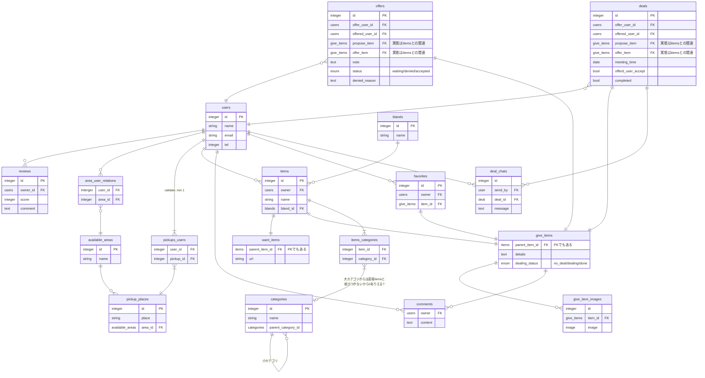

# ER Diagram
This diagram is written with `mermaid.js`

```mermaid
erDiagram

users ||--o{ reviews: ""
available_areas ||--o{ pickup_places: ""
%% 中間テーブル --
users ||--o{ area_user_relations: ""
area_user_relations }o--|| available_areas: ""
%% --
%% 中間テーブル --
users ||--|{ pickups_users: "validate: min 1"
pickups_users }|--|| pickup_places: ""
%% --
categories ||--o{ categories: "小カテゴリ"
users ||--o{ items: ""
%% スーパーテーブル(CTI)
items ||--|| want_items: ""
items ||--|| give_items: ""
%% 中間テーブル --
items ||--|{ items_categories: ""
items_categories }|--|o categories: "大カテゴリからは直接itemsと結びつかないから0ありえる?"
%% --
blands ||--o{ items: ""
give_items ||--o{ give_item_images: ""
users ||--o{ comments: ""
give_items ||--o{ comments: ""
users ||--o{ favorites: ""
favorites ||--|| give_items: ""
offers }o--|| users: ""
offers ||--|| give_items: ""
deals }o--|| users: ""
deals ||--|| give_items: ""
users ||--o{ deal_chats: ""
deals ||--o{ deal_chats: ""

users {
    integer id PK
    string name
    string email
    integer tel
}

reviews {
    integer id PK
    users owner_id FK
    integer score
    text comment
}

pickup_places {
    integer id PK
    string place
    available_areas area_id FK
}

pickups_users {
    integer user_id FK
    integer pickup_id FK
}

%% 対応可能エリア(都道府県/3件まで)
available_areas {
    integer id PK
    string name
}

area_user_relations {
    interger user_id FK
    integer area_id FK
}

categories {
    integer id PK
    string name
    categories parent_category_id
}

blands {
    integer id PK
    string name
}

favorites {
    integer id PK
    users owner FK
    give_items item_id FK
}

%% give_itemsは交換に使う、want_itemsはただの欲しい物リスト
%% 「このブランドを欲しい物リスト入れている人」検索をするためにスーパーテーブル使う(CTI)

items {
    integer id PK
    users owner FK
    string name
    blands bland_id FK
}

give_items {
    items parent_item_id FK "PKでもある"
    text details
    enum dealing_status "no_deal/dealing/done"
}

want_items {
    items parent_item_id FK "PKでもある"
    string url
}

items_categories {
    integer item_id FK
    integer category_id FK
}

give_item_images {
    integer id
    give_items item_id FK
    image image
}

comments {
    users owner FK
    text content
}

offers {
    integer id PK
    users offer_user_id FK
    users offered_user_id FK
    give_items propose_item FK "実態はitemsとの関連"
    give_items offer_item FK "実態はitemsとの関連"
    text note
    enum status "waiting/denied/accepted"
    text denied_reason
}

%% offerとoffered両方の合意で完了できる(completed=true)
deals {
    integer id PK
    users offer_user_id FK
    users offered_user_id FK
    give_items propose_item FK "実態はitemsとの関連"
    give_items offer_item FK "実態はitemsとの関連"
    date meeting_time
    bool offerd_user_accept
    bool completed
}

deal_chats {
    integer id
    user send_by FK
    deal deal_id FK
    text message
}

```
